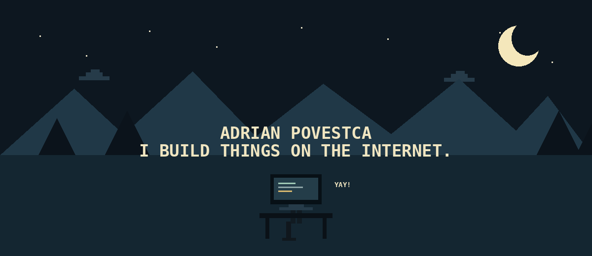
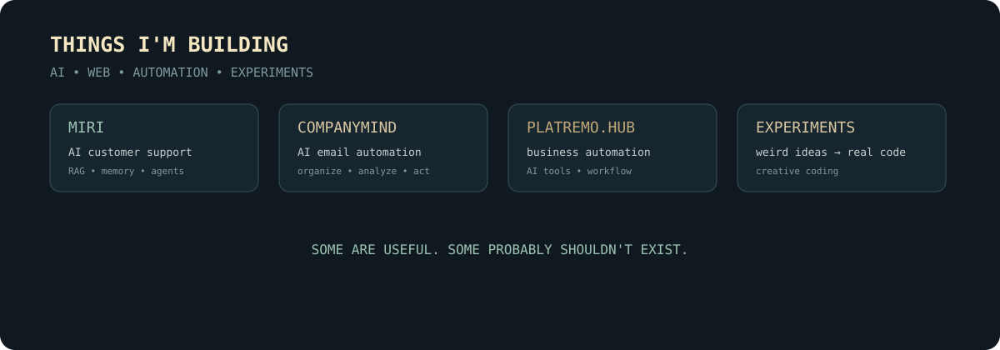

 

# ADRIAN POVESTCA

### I BUILD THINGS ON THE INTERNET.

**AI · WEB · AUTOMATION · CREATIVE EXPERIMENTS**

 

<a href="https://www.linkedin.com/in/adrian-povestca-262175414">LINKEDIN</a>
&nbsp;&nbsp;·&nbsp;&nbsp;
<a href="mailto:adrianpovestcagc@gmail.com">EMAIL</a>
&nbsp;&nbsp;·&nbsp;&nbsp;
<a href="https://github.com/AdrianPovestca">GITHUB</a>

---

## THE RULE

### SOMEONE GIVES ME AN IDEA.
### I BUILD IT.

 

---

## WHAT I BUILD

I like taking an idea, turning it into something real, and seeing what happens.

### AI SYSTEMS

- **Miri** — AI-powered customer support with company knowledge, RAG, memory and multilingual conversations.
- **CompanyMind** — AI email automation for organizing, analyzing and handling company mail.
- **PlatRemo.HUB** — business automation combining AI support and email workflows.

### CREATIVE EXPERIMENTS

- **Coffee Machine Failure** — an interactive coffee-machine disaster built with HTML, CSS and JavaScript.
- **I Love You** — a tiny interactive experiment.
- **Gut2Good SQL Analysis** — SQL/data analysis project.

---

## PROJECTS

  

---

---

## STACK

`Python` `JavaScript` `SQL` `HTML` `CSS`

`FastAPI` `Flask` `LangChain` `ChromaDB` `Docker` `Git` `GitHub` `REST APIs` `RAG`

---

### CURRENTLY BUILDING THINGS SOMEWHERE BETWEEN USEFUL AND COMPLETELY UNNECESSARY.

 

**ADRIAN POVESTCA**

