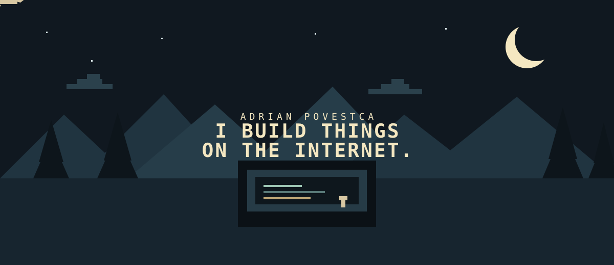

[README.md](https://github.com/user-attachments/files/32892013/README.md)

 

**AI · WEB · AUTOMATION · CREATIVE EXPERIMENTS**

[LinkedIn](https://www.linkedin.com/in/adrian-povestca-262175414) · [Email](mailto:adrianpovestcagc@gmail.com)

---

## What I build

I like taking an idea, turning it into something real, and seeing what happens.

### AI systems
- **Miri** — AI-powered customer support with company knowledge, RAG, memory and multilingual conversations.
- **CompanyMind** — AI email automation for organizing, analyzing and handling company mail.
- **PlatRemo.HUB** — a business automation platform combining AI support and email workflows.

### Creative experiments
Small projects where the idea is more important than whether it should exist.

- **Coffee Machine Failure** — an interactive coffee-machine disaster built with HTML, CSS and JavaScript.
- **I Love You** — a tiny interactive experiment.
- **Give Me Ideas** — a place where people can send me the next stupid thing to build.

---

## The rule

> **Someone gives me an idea. I build it.**

If you have a ridiculous idea worth turning into code:

**[Give me an idea →](https://give-me-ideas.adrianscriptp.workers.dev/)**

---

## Stack

`Python` `JavaScript` `SQL` `HTML` `CSS`

`FastAPI` `Flask` `LangChain` `ChromaDB` `Docker` `Git` `GitHub`

---

**Currently building things somewhere between useful and completely unnecessary.**

